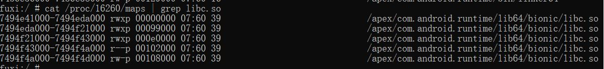

# NoHooker
一个通过控制指定内存段权限设置而实现阻止app自身inline hook行为的内核模块

# 如何使用？
加载该kpm模块后可以通过管理器控制选项输入参数，参数格式:XXXXX-XXXXX,
如要防止app hook libc，可以查看libc模块在内存中的范围，如下

此时输入参数:7494e41000-7494f4d000,即可控制这段内存区域的权限设置而使这片内存无法被修改，从而阻止该so模块被app自身hook

# 注意事项
暂时只能用于系统so库，因为这些so模块的内存地址在开机后会保持固定
暂时只支持同时对一段内存区域的权限设置
可能会和其他hook框架冲突，请谨慎使用